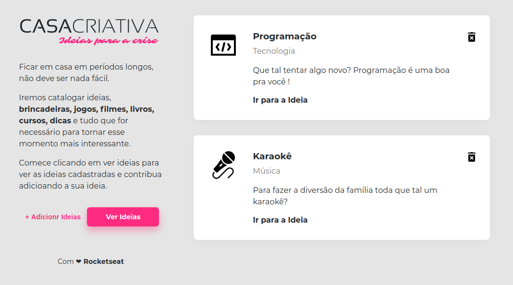
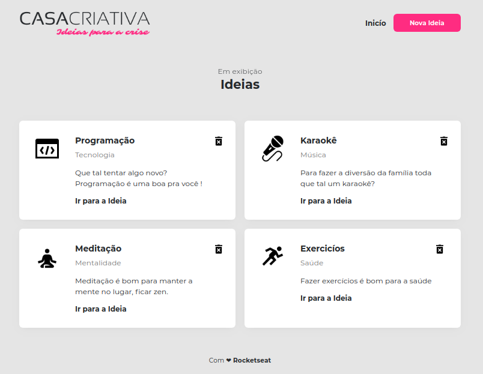
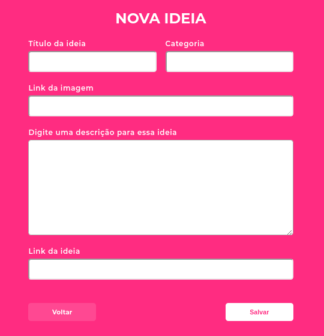

## A simple web-site page, where the following Noje.js, CSS, HTML and others tools were used. Activity proposed by RocketSeat.

### Tools
  
* Node.js
* Express
* Nunjucks
* SQLite
* HTML
* CSS

### Initial page

### List page

### Add ideas page

